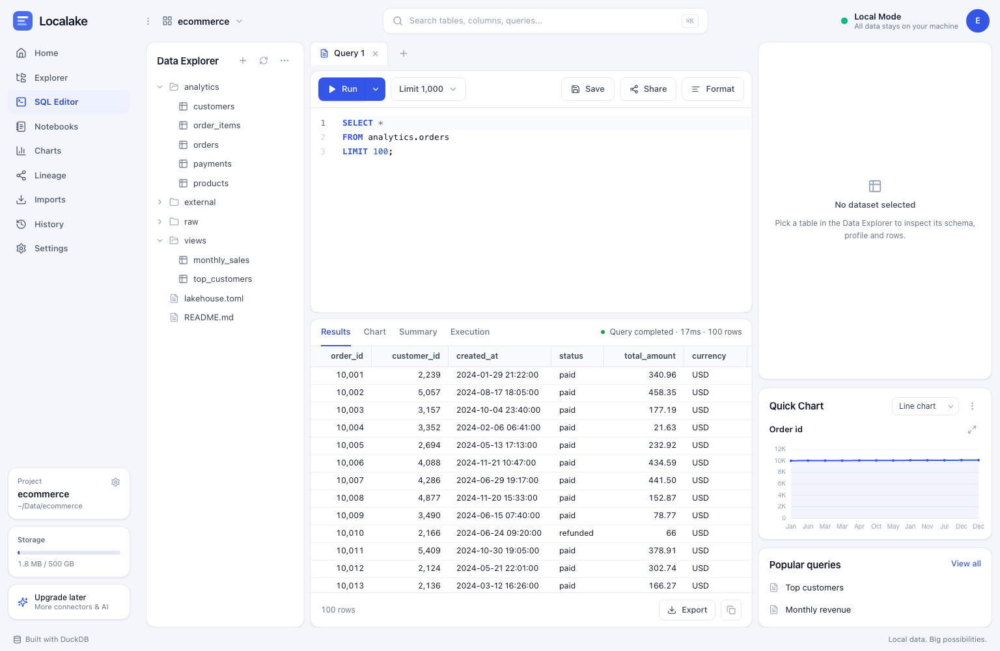

# Localake

Local-first data workspace for Parquet, DuckDB and lakehouse data.

> Point it at a folder of data. Ten seconds later you are querying it.

Localake is a single local process: a FastAPI backend talking to DuckDB, serving
a React workspace. Nothing leaves your machine — no telemetry, no CDN, no
webfonts.



## Install

```bash
uvx localake ~/Data/ecommerce     # run without installing
uv tool install localake          # or keep it around
pipx install localake             # same, via pipx
```

Node is **not** required: the interface is compiled once in CI and travels
inside the wheel.

<details>
<summary>Building from a clone</summary>

```bash
git clone https://github.com/ashiralialibek/localake && cd localake
uv sync --group dev                        # backend + tests, no Node needed
cd frontend && npm install && npm run build && cd ..
uv run localake ~/Data/ecommerce
```

`uv build` produces a wheel with the interface bundled; that step does need
Node on PATH.

</details>

## Use

```bash
localake ~/Data/ecommerce     # opens http://127.0.0.1:3000 in your browser
localake                      # reopens the last project
```

Point it at any directory. Localake writes a `lakehouse.toml` if there isn't
one, scans for Parquet, CSV and JSON, and exposes each file as a queryable
table named after its folder — `analytics/orders.parquet` becomes
`analytics.orders`.

> **Keep it on localhost.** Localake has no authentication and its SQL editor
> can read and write any file the process can reach. It refuses to bind a
> network address without `--allow-remote`. To use it from another machine,
> forward the port: `ssh -L 3000:127.0.0.1:3000 you@machine`. See
> [SECURITY.md](SECURITY.md).

| Flag | |
|---|---|
| `--port 8080` | serve somewhere else (default 3000) |
| `--no-browser` | don't open a browser window |
| `--no-watch` | don't rescan when files change |
| `--reload` | reload on backend code changes |

To try it without data of your own:

```bash
python scripts/make_sample_project.py ~/Data/ecommerce
```

## What it does

- **Home** — project overview: size on disk, recent and saved queries, charts
- **Explorer** — a sortable catalog of every dataset with rows, columns and size
- **Data tree** — folders, datasets and files beside the editor; Hive-partitioned
  directories and multi-part Parquet collapse into a single table
- **SQL editor** — Monaco with autocomplete driven by your actual catalog,
  multiple tabs, `⌘↵` to run, Stop to interrupt a running query
- **Results** — virtualized grid with server-side sort and filter, CSV/JSON
  export; results are materialised once, so paging never re-runs your query
- **Inspector** — schema with null rates read from Parquet footers (no scan),
  `SUMMARIZE`-backed profiling, and a preview that never reads past its `LIMIT`
- **Charts** — quick chart beside the editor, full axis control in the Chart tab,
  and a gallery of saved charts that re-run their own SQL so they stay current.
  Charts are plain JSON files in `charts/`, so they version with your data
- **Lineage** — a graph of files → tables → views → queries → charts, derived by
  parsing your SQL with sqlglot; click a node to jump to the thing it represents
- **History and saved queries** — every run recorded with duration and row count,
  searchable and filterable by date
- **Import** — upload a Parquet, CSV or JSON file into a project folder and query
  it immediately
- **Notebooks** — ordered SQL cells over the same DuckDB session, saved as JSON
  files in the project
- **Execution** — how long it took, how many rows came off storage, and a drawn
  operator tree
- **⌘K** — search tables, columns, saved queries and charts

## Development

Run the API and the Vite dev server side by side:

```bash
uv sync --group dev
cd frontend && npm install && cd ..

uv run localake ~/Data/ecommerce --reload --port 8787   # terminal 1
cd frontend && npm run dev                        # terminal 2
```

The dev server on :5173 proxies `/api` and `/ws` to the backend.

```bash
uv run pytest                    # backend tests
cd frontend && npm run typecheck # frontend types
```

## Layout

```
backend/localake/   FastAPI app, DuckDB engine, catalog, storage
frontend/src/       Vite + React + TypeScript workspace UI
scripts/            sample data generator, wheel build hook
tests/              backend tests
```

A full overview with diagrams lives in [docs/ARCHITECTURE.md](docs/ARCHITECTURE.md).

Project metadata (saved queries, charts, history) lives in `.localake/` inside
your project folder as plain JSON. The DuckDB catalog is held in memory and
rebuilt on startup, so nothing binary is written into your data directory and
two Localake instances can share a folder.

## How much it handles

Measured on a 75-million-row, 2.3 GB Parquet dataset on a laptop:

| | |
|---|---|
| Row count, schema and null rates | 3–6 ms — read from the Parquet footer, no scan |
| `GROUP BY` across all 75M rows | 0.24 s |
| `COUNT(DISTINCT)` over 20M keys | 1.25 s |
| Self-join, 75M × 75M | 4.8 s |
| Memory | 76 MB idle, 1.1 GB peak |

Metadata cost does not grow with file size, so a folder of any size opens
instantly. Query time scales with the bytes actually scanned. The practical
ceiling is disk space for spilling large joins and sorts, not RAM — keep free
space at least the size of your largest intermediate result.

CSV and JSON have no footer, so row counts and null rates need a full pass over
the file. For anything large, convert to Parquet.

## Not there yet

Remote connectors (Postgres, MySQL, S3/MinIO), a dark theme, and Delta/Iceberg
remain on the roadmap. Notebooks and Imports are implemented. See
[ROADMAP.md](ROADMAP.md).

## Contributing

See [CONTRIBUTING.md](CONTRIBUTING.md).

## Licence

Apache-2.0. See [LICENSE](LICENSE).
