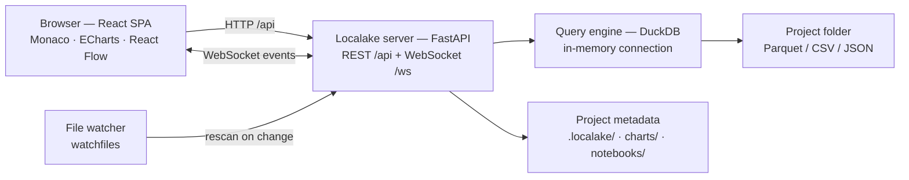
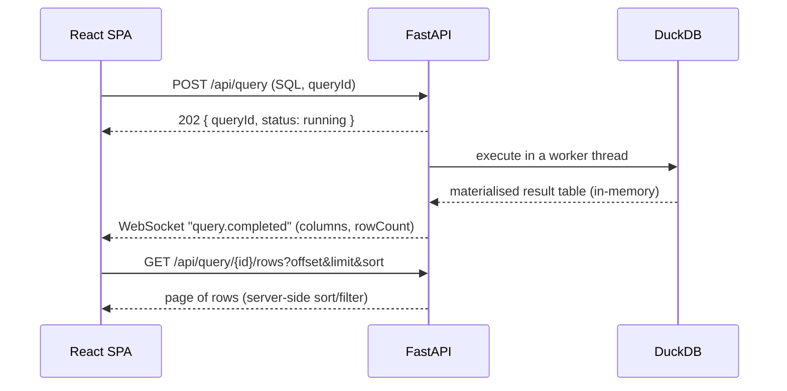

# Localake — Architecture

## What it is for

Localake is a **local-first data workspace**: point it at a folder of Parquet,
CSV or JSON files and, within seconds, you are exploring and querying it with
SQL in a browser. It is a single local process — a FastAPI backend talking to
DuckDB, serving a React workspace. Nothing leaves your machine: no telemetry,
no CDN, no webfonts.

The core promise is one sentence:

> *"I have a folder of data. I open Localake and ten seconds later I am
> analysing it."*

Typical flow: **open a project → explore data → write SQL → inspect → visualise
→ save** (queries, charts and notebooks as plain files in the project).

## Architecture



There is no separate database server and no cloud. DuckDB runs **inside** the
Localake process; the filesystem is the warehouse.

## How a query runs



Key point: the result is **materialised once** into an attached in-memory
database, so paging, sorting, filtering, charting and export are SQL against
that table — they never re-run the user's query.

## Repository layout

```
backend/localake/   FastAPI app, DuckDB engine, catalog, storage, lineage
  api/              HTTP + WebSocket routes
  catalog/          filesystem scan → tables, schema, profiling
  query/            DuckDB execution, result store, serialisation
  lineage/          SQL parsing into a graph (sqlglot)
  project/          lakehouse.toml and paths
  storage/          JSON metadata under .localake/ and project folders
frontend/src/       Vite + React + TypeScript workspace UI
  features/         one directory per screen (editor, results, charts, …)
  lib/              API client, formatting, chart options
scripts/            sample-data generator, wheel build hook
tests/              backend end-to-end tests
docs/               screenshots and this document
```

## Key design decisions

- **The catalog is derived, not stored.** Every DuckDB view is rebuilt from the
  filesystem scan at startup and on file change. Nothing binary is written into
  the data folder, so two Localake instances can share a project.
- **The connection is in-memory on purpose.** A file-backed DuckDB takes an
  exclusive lock; in-memory means the catalog can be rebuilt freely.
- **Results are materialised once.** See above — paging never re-runs SQL.
- **Metadata is plain JSON/TOML.** Saved queries live in `.localake/`; charts and
  notebooks live as JSON files in `charts/` and `notebooks/` so they can be
  committed and diffed alongside the data.
- **Local-only by default.** The server binds `127.0.0.1` and refuses any other
  address without `--allow-remote`; there is deliberately no authentication
  because the SQL editor can reach any file the process can (see SECURITY.md).
- **The UI ships inside the wheel.** The frontend is compiled in CI and bundled
  as `localake/web/`, so installed users never need Node.

## Running it

```bash
uvx localake ~/Data/ecommerce     # run without installing
```

For development:

```bash
uv sync --group dev
cd frontend && npm install && npm run build && cd ..
uv run localake ~/Data/ecommerce --reload --port 8787   # terminal 1
cd frontend && npm run dev                              # terminal 2
```

Checks:

```bash
uv run pytest                    # backend tests
uvx ruff check backend tests scripts
cd frontend && npm run typecheck # frontend types
```

See [../README.md](../README.md) and [../CONTRIBUTING.md](../CONTRIBUTING.md) for
the full picture.
